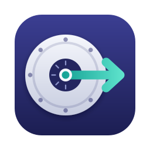

# XCodeVault

XCodeVault shows what Xcode, the Simulator and their tools keep on your Mac's internal disk, and
frees the part that can be freed safely — while Xcode, the Simulator, `xcodebuild`, `simctl` and
`devicectl` keep working. It is not finished: read [the honest state](#the-honest-state) before
trusting it with anything you cannot re-create.

## What it does

- **Accounts** for developer storage per category (simulator runtimes, CoreSimulator data,
  DerivedData, device support, caches, archives) and says which part is cleanable, relocatable
  with Apple's own mechanisms, or neither.
- **Cleans** the regenerable data you select, showing the plan first and journaling every change.
- **Relocates** only through Apple-supported mechanisms, or by a verified copy to an external
  drive you register.
- **Diagnoses** unsafe setups, such as data written to an external drive's path while the drive was
  unplugged, and proposes the fix. It never applies a fix on its own.

## Install

- **Today — build from source** (macOS 14 or later, a recent Xcode):

  ```bash
  git clone https://github.com/pabloguia/XCodeVault.git
  cd XCodeVault
  swift build
  ```

  `scripts/bundle-app.sh` assembles `dist/XCodeVault.app`. Builds made this way have no Developer ID:
  they are signed ad hoc, with the hardened runtime, so a rebuild may need Full Disk Access granted again.
- **Planned — not available yet:** a signed, notarized DMG and a Homebrew cask.

## First run

Nothing is asked for. The first run scans and shows; it changes nothing.

```bash
.build/debug/xcodevaultctl scan      # what you can reclaim, temporarily and permanently
.build/debug/xcodevaultctl plan delete # what to run to delete regenerable data (also: park, external)
.build/debug/xcodevaultctl scan --details # every item, per category
.build/debug/xcodevaultctl doctor    # unsafe or broken setups, and the proposed fix for each
.build/debug/xcodevaultctl clean     # the cleanup plan; nothing is deleted without --apply
```

## Permissions

By design (ADR-0007), XCodeVault asks for a permission only when an action needs it, and says why;
the last column says what this build does.

| Permission | Asked for when | Why | How it is asked | In this build |
|---|---|---|---|---|
| Full Disk Access | A scan could not read folders because macOS privacy protection refused it | Those folders' sizes are missing from the totals | The app opens the exact System Settings pane; you switch it on; the app notices and scans again. Code cannot grant it, so the app never tries | `xcodevaultctl permissions` reports it. The app asks when a scan was refused, and its Access screen shows the state (built and unit-tested; not yet exercised on screen) |
| Privileged helper — a background item that runs as root, approved once by an administrator | You choose an action that needs root: creating the vault folder on a drive whose top folder belongs to root, or emptying the CoreSimulator dyld cache (experimental) | Those paths belong to root; the helper can do only a fixed list of actions on paths it resolves itself | A one-sentence sheet with **Allow**; then macOS asks you to approve the helper in Login Items & Extensions | Not available in any build made today: it needs a signed build that includes the helper (issue #30), and it has never run live. Until then the app's helper row says "Not in this build" and shows what to do instead: the signed release, or the manual route where there is one: `vault init` and `doctor` print the command for the vault folder; the dyld cache stays listed, not cleaned |

XCodeVault never asks for your password itself, never runs `sudo`, and never opens a root shell.
Details, and the rest of the product, are in the [user guide](docs/USER_GUIDE.md).

## What it never does

- Disable SIP, ask you to, or modify `/System`.
- Run a root shell. Root work goes only through the helper's fixed list of actions.
- Delete Archives, or anything else that cannot be regenerated, unless you choose that item.
- Delete a source before its copy has been verified.
- Symlink `~/Library/Developer`, its `CoreSimulator`, or its `DeveloperDiskImages`.

## The honest state

| Area | State |
|---|---|
| Accounting (`scan`, `status`, `report`, `doctor`, `volumes`, `journal`, `compatibility`) | Working. Read-only; `--json` on every read command. |
| Cleanup and Apple-supported relocation (`clean`, `locations`, `runtime`) | Working, journaled, gated. These change your machine, and every strategy stays labelled **experimental** until it meets the Definition of Done. |
| Vault / external migration (`vault`, `externalize`, `restore`, `migration`) | **Experimental.** Verified copy; the source is removed only when you opt in. |
| GUI | Savings first: an Overview with the disk bar and three cards; Delete (the clean flow, grouped, with the cost to undo); Park and Run externally, which show the commands to copy and run none of them; the Details screens (Storage, Simulators, Drives, Health, History) and an Access checklist. Buttons for the two root actions appear only in a build that can reach the helper — none can yet. Not yet exercised in a signed build. |
| Privileged helper | Built and security-reviewed. The app can register it and call its two verbs, gated on a signed build that includes it — none exists, so it has never run live (issue #30). |
| Releases | None. Nothing is signed or notarized. |
| CI | Every push to `main` and every pull request, on `macos-15` and `macos-26`. |

Every compatibility claim was measured on a single Mac — one architecture, two macOS builds of the
same major version, one Xcode. What was not measured is marked pending in
[`docs/architecture/COMPATIBILITY_MATRIX.md`](docs/architecture/COMPATIBILITY_MATRIX.md).

## For contributors

- [`CONTRIBUTING.md`](CONTRIBUTING.md) — the contribution this project is short of is an experiment
  run on a Mac that is not the author's. Read [`SECURITY.md`](SECURITY.md) before reporting
  anything about the root helper.
- [`CLAUDE.md`](CLAUDE.md) and [`docs/product/NON_GOALS_AND_SAFETY.md`](docs/product/NON_GOALS_AND_SAFETY.md) — the safety rules in full.
- [`docs/research/`](docs/research/), [`docs/architecture/HYPOTHESES.md`](docs/architecture/HYPOTHESES.md),
  [`docs/architecture/EXPERIMENTS.md`](docs/architecture/EXPERIMENTS.md) — findings, open questions, experiments.
- [`docs/adr/`](docs/adr/) — decisions, including the ones that reversed earlier decisions.
- [`STATUS.md`](STATUS.md) — what is in flight and what is next.

## License

[MIT](LICENSE). `xcodevaultctl` statically links
[swift-argument-parser](https://github.com/apple/swift-argument-parser) (Apache-2.0 with the Runtime
Library Exception) and ships inside the app bundle and the Homebrew cask;
[THIRD-PARTY-LICENSES.md](THIRD-PARTY-LICENSES.md) carries its licence text and the reasoning, and is
copied into `XCodeVault.app/Contents/Resources/`.
